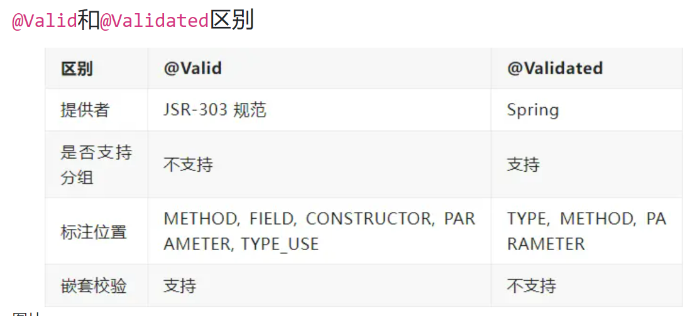

@Delegate:
> @Delegate注解是Java中的一种注解，用于将方法的调用委托给另一个对象。它允许一个类将方法的调用转发给另一个对象，从而实现方法的代理。

- fail-fast

  Spring Validation默认会校验完所有字段，然后才抛出异常。可以通过一些简单的配置，开启Fali Fast模式，一旦校验失败就立即返回

```java
@Bean  
public Validator validator() {  
    ValidatorFactory validatorFactory = Validation.byProvider(HibernateValidator.class)  
            .configure()  
  
            .failFast(true)  
            .buildValidatorFactory();  
    return validatorFactory.getValidator();  
}
```




